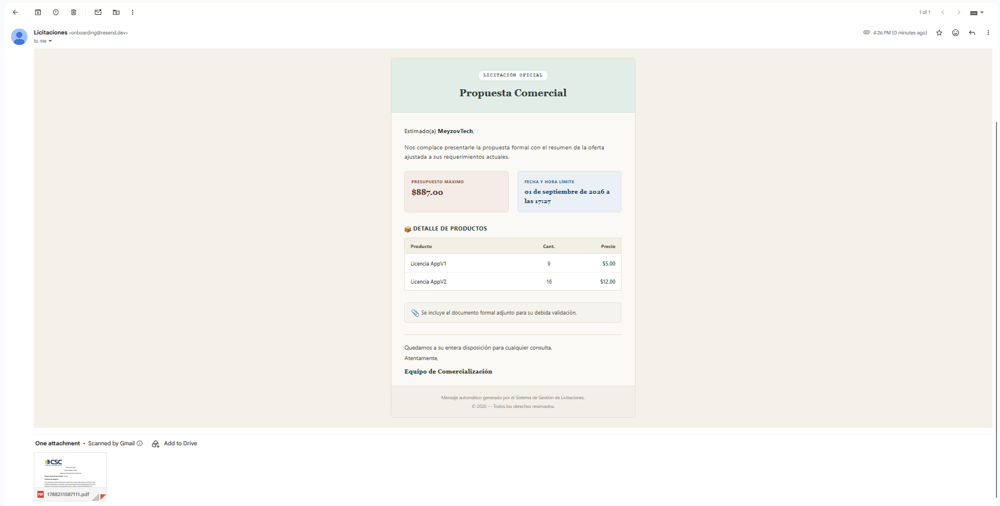
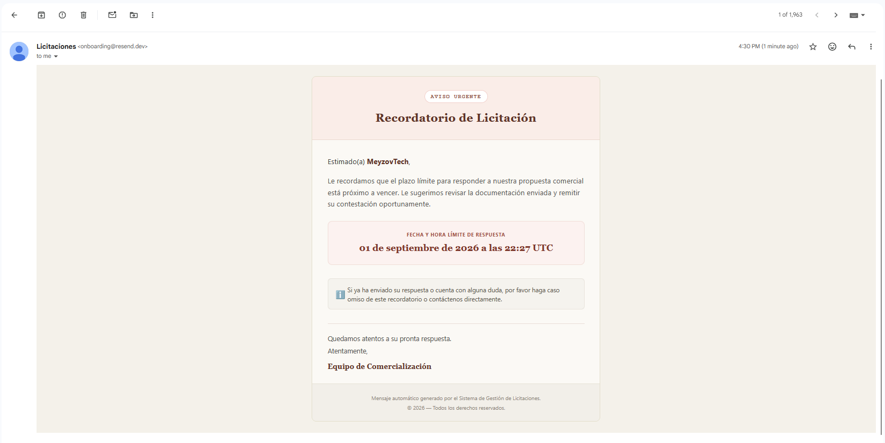
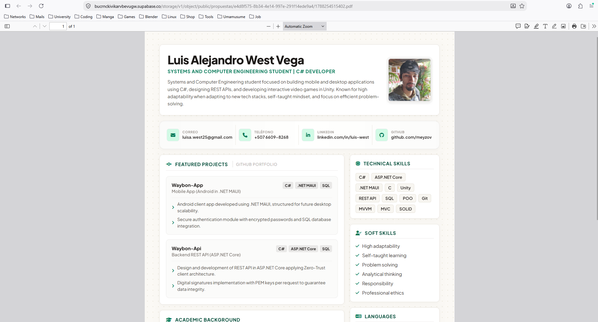

# Sistema de Gestión de Licitaciones

Aplicación web donde una empresa administra licitaciones comerciales para sus clientes: crea la licitación, adjunta una propuesta, la envía formalmente por correo, agrega productos, controla el presupuesto, hace seguimiento hasta la fecha límite (con recordatorios y vencimiento automático), y factura/cobra hasta saldar — todo auditado y con historial de transiciones de estado.

## Stack

- **Full-stack**: Next.js 16 (App Router) + TypeScript
- **Base de datos**: PostgreSQL en Supabase, gestionada con Prisma 7
- **Autenticación**: Supabase Auth (email/password), roles `admin`/`user` en tabla propia `usuarios`
- **Almacenamiento de archivos**: Supabase Storage (bucket público `propuestas`)
- **Email transaccional**: Resend (con adjuntos reales, templates en `src/components/email-template.tsx` y `email-reminder.tsx`)
- **Tarea programada**: endpoint HTTP protegido por secret, invocado cada 10 minutos por [cron-job.org](https://console.cron-job.org)
- **Despliegue**: Render

## Instalación local

### 1. Clonar e instalar dependencias

```bash
git clone <url-del-repo>
cd licitaciones-app
npm install
```

### 2. Variables de entorno

Crea un archivo `.env` en la raíz con:

```bash
DATABASE_URL=postgresql://<user>:<password>@<host>:<port>/<database>
NEXT_PUBLIC_SUPABASE_URL=https://<tu-proyecto>.supabase.co
NEXT_PUBLIC_SUPABASE_PUBLISHABLE_KEY=<tu-publishable-key>
SUPABASE_SECRET_KEY=<tu-secret-key>
RESEND_API_KEY=re_xxxxxxxxxxxx
CRON_SECRET=<un-string-secreto-cualquiera>
SYSTEM_USER_ID=<se-completa-en-el-paso-4>
```

Las claves de Supabase se obtienen en el dashboard (Connect -> Direct (Session pooler) y tambien en Connect -> Server), la de Resend en su dashboard (API Keys).

### 3. Migrar la base de datos

> ⚠️ Este comando solo funciona contra una base de datos **completamente nueva** (sin las tablas del proyecto en el schema `public`, y sin que la FK hacia `auth.users` ya exista). Ejecútalo **una sola vez**, contra un proyecto de Supabase recién creado.

```bash
npx prisma migrate deploy
```

Esto crea las 7 tablas, los enums de estado/rol, y la relación hacia `auth.users` de Supabase (incluida en el archivo de migración).

### 4. Crear los usuarios iniciales

Como no existe registro público (solo un admin puede crear usuarios), se crean con dos scripts separados:

```bash
npm run seed-admin
```

Crea el primer administrador con el que vas a iniciar sesión en la aplicación.

```bash
npm run seed-system
```

Crea un usuario de sistema. **Copia el `id` y colócalo en `SYSTEM_USER_ID`** dentro de tu `.env` — el cron lo usa para atribuir las transiciones automáticas (vencimiento, recordatorio) a un usuario real, en vez de dejar ese campo vacío.

### 5. Correr en desarrollo

```bash
npm run dev
```

Abre `http://localhost:3000` — redirige automáticamente a `/auth/login`.

## Configuración de servicios externos

### Supabase Storage

Crea un bucket llamado `propuestas` y márcalo como **público** desde el dashboard de Supabase (Storage → New bucket → Public bucket).

### Resend

En el plan gratuito, solo se pueden enviar correos a la dirección de email verificada en tu cuenta de Resend (hasta verificar un dominio propio). Para probar el flujo completo, el email del Cliente de prueba debe coincidir con tu email verificado en Resend.

### Cron externo

El endpoint `GET /api/cron/verificar-licitaciones` requiere el header `Authorization: Bearer <CRON_SECRET>`. Configúralo en [cron-job.org](https://console.cron-job.org) (o servicio similar) apuntando a tu URL de Render, con ese header, cada 5 minutos. Esto cubre tanto el vencimiento automático (Regla 2) como el recordatorio de 48h (Regla 5), y de paso evita que el servicio de Render (plan gratuito) se "duerma" por inactividad.

## Despliegue en Render

1. Conecta el repositorio a un nuevo **Web Service** en Render.
2. Build command: `npm install && npm run build`
3. Start command: `npm run start`
4. Agrega todas las variables de entorno listadas arriba en la sección Environment.
5. Tras el primer deploy, corre **una sola vez** (localmente, apuntando tu `DATABASE_URL` al Supabase de producción):

```bash
   npx prisma migrate deploy
   npm run seed-admin
   npm run seed-system
```

   Luego actualiza `SYSTEM_USER_ID` en las variables de entorno de Render con el id del usuario que se creo con `seed-system`, y vuelve a desplegar.

## Estructura del proyecto

```Bash
prisma/
├── schema.prisma
└── migrations/

src/
├── app/
│   ├── (app)/                  → rutas privadas, comparten layout con sidebar
│   │   ├── dashboard/           → panel principal con KPIs y próximas a vencer
│   │   ├── clientes/            → listado, creación y edición ([id])
│   │   ├── productos/           → listado, creación y edición ([id])
│   │   ├── usuarios/            → listado, creación y edición ([id]) — creación solo admins
│   │   └── licitaciones/
│   │       ├── [id]/            → detalle general + subir/enviar documento
│   │       ├── [id]/productos/  → agregar/quitar productos, valida presupuesto
│   │       ├── [id]/transiciones/ → historial de cambios de estado
│   │       └── [id]/pagos/      → registrar pagos, saldo pendiente
│   ├── auth/
│   │   ├── login/
│   │   └── logout/
│   └── api/                     → todos los endpoints REST (route handlers)
│
├── components/
│   ├── email-template.tsx       → plantilla del correo de envío de licitación
│   ├── email-reminder.tsx       → plantilla del correo de recordatorio (48h)
│   └── layout/                  → sidePanel, topPanel, menuLayoutClient (+ sus CSS)
│
├── lib/
│   ├── supabase/                → clients de Supabase (client y server)
│   ├── prisma.ts                → instancia compartida de Prisma
│   ├── get-authenticated-user.ts
│   ├── money.ts                 → helper de redondeo monetario
│   └── useToast.ts
│
└── scripts/
    ├── seed-admin.ts             → crea el primer administrador
    └── seed-system.ts            → crea el usuario de sistema (para SYSTEM_USER_ID)
```

## Modelo de datos y reglas de negocio

El diseño completo (entidades, relaciones, reglas de negocio, decisiones de arquitectura) está documentado en [`docs/diseño.md`].

## Estados de una licitación

`borrador → activa → finalizada → por_cobrar → cobrada`, con la rama `activa → perdida` (manual o automática por vencimiento). Cada transición queda registrada en el historial con usuario, fecha y estado anterior/nuevo. Las licitaciones en `borrador` pueden eliminarse.

## Limitaciones conocidas

- El plan gratuito de Render puede tener un breve retraso (cold start) si el servicio estuvo inactivo más de 15 minutos, aunque el cron externo lo mitiga llamando cada 5 minutos.
- El plan gratuito de Resend limita el envío a la dirección de correo verificada de la cuenta.
- `npx prisma migrate deploy` debe ejecutarse solo una vez, contra una base de datos nueva (ver nota en la sección de instalación).

## Evidencias

### Correo real recibido con documento adjunto



### Correo real recibido del recordatorio



### Documento accesible vía URL pública


