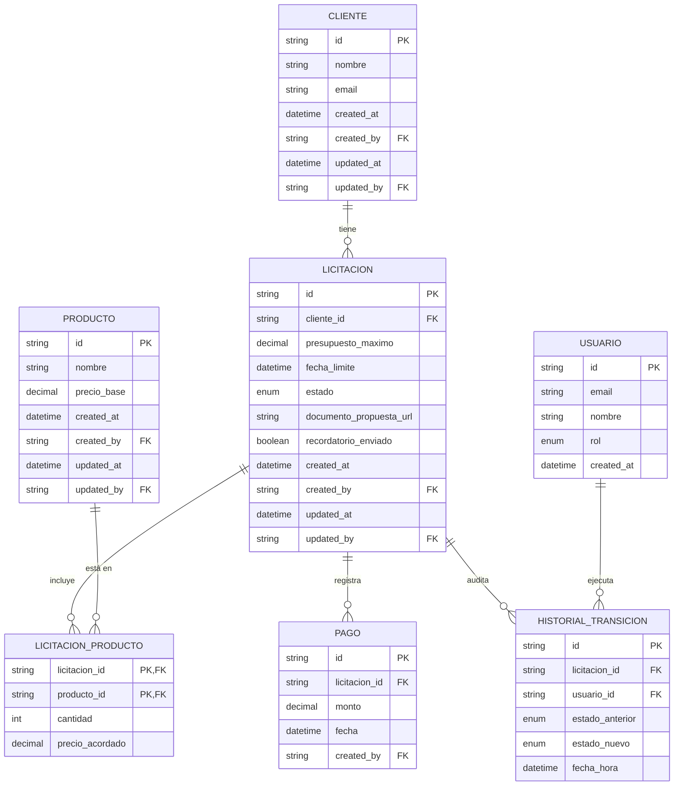

# Sistema de Gestión de Licitaciones — Documento de Diseño

## Qué es una licitación

Una licitación es un proceso administrativo en donde una entidad pública o privada busca adquirir suministros, servicios o llevar a cabo proyectos constructivos recurriendo a empresas proveedoras o contratistas. Las licitaciones comerciales ocurren enteramente en el ámbito privado.

## Contexto del negocio

Esta empresa necesita administrar licitaciones comerciales para sus clientes. Cada licitación le pertenece a un cliente. Estas licitaciones contienen productos que la empresa planea vender, requieren un documento de propuesta formal, y se deben enviar oficialmente a la empresa cliente antes de que el plazo de presentación corra.

En conclusión, esta es una empresa que vende productos a otras empresas (B2B). Por medio de un sistema, la empresa crea licitaciones (propuestas comerciales) junto con un documento de propuesta formal, y las envía a sus empresas clientes. Dichas licitaciones tienen estados que cambian a lo largo de su ciclo de vida.

## Tecnologías utilizadas

- **Next.js** — full-stack (backend y frontend en el mismo proyecto)
- **Supabase** — PostgreSQL, Auth y Storage
- **Render** — despliegue
- **Resend** — email transaccional
- **cron-job.org** — disparo externo del chequeo programado

## Integraciones obligatorias

- **Email transaccional real**: Resend, elegido por su facilidad de implementación y buen soporte de adjuntos.
- **Almacenamiento de archivos**: Supabase Storage, elegido porque ya se usa Supabase para la base de datos PostgreSQL — un solo proveedor, un solo set de credenciales.
- **Tarea programada**: un endpoint HTTP propio, protegido con un secret, invocado periódicamente por un servicio de cron externo (cron-job.org). Esto además evita que el servicio web en el plan gratuito de Render se "duerma" por inactividad.

## Seguridad

- Login con email y password, roles base (`admin`, `user`), sesión vía cookies (Supabase Auth).
- Auditoría (quién creó/modificó y cuándo) en cada entidad de negocio.
- Solo los administradores pueden crear otros usuarios.
- Cada usuario solo puede editar su propio email y contraseña — ni siquiera un admin puede modificar las credenciales de otro usuario.

---

## Entidades

### Usuario

| Campo | Tipo | Notas |
|---|---|---|
| `id` | UUID, PK | mismo id que genera Supabase Auth en `auth.users`, vincula autenticación con datos de negocio |
| `email` | string | identificador de login |
| `nombre` | string | nombre visible |
| `rol` | enum (`admin`, `user`) | determina permisos |
| `created_at` | datetime | cuándo se creó la cuenta |

No se agregan `created_by`/`updated_by` a Usuario porque generaría una referencia circular (un usuario creado por otro usuario, que a su vez...). Se deja simple con `created_at`, ya que quién lo creó siempre es un admin.

### Cliente

| Campo | Tipo | Notas |
|---|---|---|
| `id` | UUID, PK | |
| `nombre` | string | nombre de la empresa cliente |
| `email` | string | a dónde se envían los correos de la licitación |
| `created_at`, `created_by`, `updated_at`, `updated_by` | auditoría | requisito explícito del documento |

**Relación:** 1 Cliente → N Licitaciones. Es la entidad más simple del modelo — solo lo mínimo necesario para identificar al cliente y contactarlo; el documento no pide más campos (dirección, teléfono, etc.), así que no se agregan por especulación.

### Licitación

| Campo | Tipo | Notas |
|---|---|---|
| `id` | UUID, PK | |
| `cliente_id` | FK → Cliente | |
| `presupuesto_maximo` | decimal | tope que no puede superar la suma de productos (Regla 1) |
| `fecha_limite` | datetime | usada para vencimiento automático y recordatorio de 48h (Reglas 2 y 5) |
| `estado` | enum (`borrador`, `activa`, `finalizada`, `por_cobrar`, `cobrada`, `perdida`) | controla el ciclo de vida completo |
| `documento_propuesta_url` | string, nullable | referencia al archivo en Supabase Storage; obligatorio antes de pasar a `activa` (Regla 3) |
| `recordatorio_enviado` | boolean | evita reenviar el correo de recordatorio en cada ejecución del cron |
| `created_at`, `created_by`, `updated_at`, `updated_by` | auditoría | |

**Relaciones:** N:1 con Cliente · N:M con Producto (vía `Licitación_Producto`) · 1:N con Pago · 1:N con Historial_Transición.

Es la entidad central del sistema — casi todas las reglas de negocio giran alrededor de sus estados y ciclo de vida. Se usa `decimal` (no `float`) para montos, por precisión exacta en las validaciones de presupuesto y saldo. `estado` es un enum simple porque los 6 valores son fijos y no cambian dinámicamente; no se justifica una tabla `estados` aparte.

### Producto

| Campo | Tipo | Notas |
|---|---|---|
| `id` | UUID, PK | |
| `nombre` | string | |
| `precio_base` | decimal | precio de catálogo |
| `created_at`, `created_by`, `updated_at`, `updated_by` | auditoría | |

**Relación:** N:M con Licitación (vía `Licitación_Producto`). Es un catálogo reutilizable, no algo que se crea de nuevo en cada licitación. Se separa `precio_base` (del catálogo) de `precio_acordado` (de la licitación específica) para permitir que el mismo producto se negocie a precios distintos según el cliente, sin perder el precio de referencia original.

### Licitación_Producto (tabla intermedia)

| Campo | Tipo | Notas |
|---|---|---|
| `licitacion_id` | PK compuesta, FK → Licitación | |
| `producto_id` | PK compuesta, FK → Producto | |
| `cantidad` | int | |
| `precio_acordado` | decimal | |

El documento especifica la relación como "N:M, con cantidad y precio" — obliga a una tabla intermedia con atributos propios. No lleva auditoría propia porque su ciclo de vida está atado al de la Licitación (se crea/borra junto con las operaciones de agregar/quitar productos, que ya quedan registradas indirectamente vía la auditoría de Licitación).

### Pago

| Campo | Tipo | Notas |
|---|---|---|
| `id` | UUID, PK | |
| `licitacion_id` | FK → Licitación | |
| `monto` | decimal | |
| `fecha` | datetime | |
| `created_by` | FK → Usuario | quién registró el pago |

**Relación:** N:1 con Licitación (múltiples pagos, solo válido en estado `por_cobrar`, Regla 6). No lleva `updated_at`/`updated_by` porque un pago registrado no se edita — es un movimiento contable, similar a un asiento.

### Historial_Transición

| Campo             | Tipo            | Notas                   |
| ----------------- | --------------- | ----------------------- |
| `id`              | UUID, PK        |                         |
| `licitacion_id`   | FK → Licitación |                         |
| `usuario_id`      | FK → Usuario    | quién ejecutó el cambio |
| `estado_anterior` | enum, nullable  |                         |
| `estado_nuevo`    | enum            |                         |
| `fecha_hora`      | datetime        |                         |

Requisito explícito: "Cada cambio de estado de una Licitación genera un registro en el Historial de Transiciones". Es distinta de la auditoría genérica (`created_by`/`updated_by`) porque registra específicamente cambios de *estado*, no cualquier modificación de cualquier campo — son dos mecanismos complementarios, no redundantes.

### Decisiones de diseño transversales

1. **UUID como PK en todo** — consistente con que Supabase Auth genera UUIDs, evita mezclar tipos de ID entre tablas relacionadas con Usuario.
2. **`decimal`/`numeric` para todo dinero** — evita errores de redondeo binario en cálculos de saldo, presupuesto y pagos (ver sección de precisión monetaria más abajo).
3. **Enum para `rol` y `estado`** — ambos son conjuntos fijos y pequeños; no justifican una tabla aparte.
4. **Auditoría (`created_by`/`updated_by`) en Cliente, Licitación, Producto** — requisito explícito. Se omite en `Licitación_Producto` (vive dentro del ciclo de Licitación) y se simplifica en Pago (solo `created_by`, porque no se edita).

## Relación entre entidades

---

## Reglas de negocio principal

| # | Regla | Dónde vive | Mecanismo |
|---|---|---|---|
| 1 | El total de productos no debe superar el `presupuesto_maximo` | API | Validación antes de insertar en `Licitación_Producto` |
| 2 | Vencimiento automático: si pasa `fecha_limite` y sigue `activa` → `perdida` | API | Endpoint de cron, invocado externamente |
| 3 | Solo puede enviarse (→ `activa`) si tiene documento adjunto | API | Validación antes de transicionar |
| 4 | Al pasar a `activa`, se envía correo real al cliente con resumen + adjunto | API | Resend, disparado dentro de la transición |
| 5 | Si quedan menos de 48h para `fecha_limite`, se envía recordatorio | API | Mismo endpoint de cron que la regla 2 |
| 6 | En `por_cobrar` se registran pagos; no exceden el saldo pendiente; saldo en 0 → `cobrada` | API | Cálculo de saldo + transición, en una transacción de Prisma |
| 7 | Toda transición queda en el historial; solo se permiten las transiciones válidas | API | Validación de estado + registro en cada endpoint de transición |

### Por qué no van en triggers de base de datos

- Postgres no puede llamar a servicios externos (Resend, Supabase Storage) — la regla 4 obligatoriamente requiere código de aplicación.
- Los cálculos de las reglas 1 y 6 dependen de sumar filas relacionadas contra un campo — más simple, testeable y legible en el backend que en SQL puro.
- Los errores de triggers llegan como excepciones crudas de base de datos, no como mensajes de negocio claros para el frontend.

### Constraints que sí van en base de datos (respaldo estructural)

No reemplazan la validación de la API — son una defensa adicional si algo escribiera directo a la base sin pasar por el backend:

- `CHECK (monto > 0)` en Pago
- `CHECK (cantidad > 0)` en Licitación_Producto
- `NOT NULL` en campos obligatorios (`fecha_limite`, `cliente_id`, `presupuesto_maximo`, etc.)

### Precisión monetaria

Todos los cálculos que suman o restan montos (saldo pendiente, total de productos contra presupuesto) redondean explícitamente a 2 decimales antes de comparar, para evitar errores de precisión de punto flotante propios de JavaScript (por ejemplo, `0.1 + 0.2 !== 0.3`).

---

## Estados de la licitación y tabla de transiciones

**Estados:** `borrador` (implícito, antes de enviar), `activa`, `finalizada`, `por_cobrar`, `cobrada`, `perdida`.

| Estado actual | Estado nuevo | Disparo | Condición |
|---|---|---|---|
| `borrador` | `activa` | Manual | Requiere documento de propuesta adjunto. Dispara correo al cliente (Regla 4) |
| `activa` | `finalizada` | Manual | La empresa ganó y completó la entrega |
| `activa` | `perdida` | Manual o automática | Manual: no se ganó. Automática: se venció la fecha límite sin resolución (Regla 2) |
| `finalizada` | `por_cobrar` | Manual | Se facturó, queda pendiente el cobro |
| `por_cobrar` | `cobrada` | Automática | Cuando el saldo pendiente llega a 0 tras los pagos (Regla 6) |

**Restricción adicional:** una licitación en `finalizada`, `por_cobrar`, `cobrada` o `perdida` no permite agregar ni quitar productos. Una licitación en `borrador` puede eliminarse por completo.

---

## API implementada

Organizada por entidad. Todos los endpoints requieren sesión activa salvo que se indique lo contrario.

### Clientes

| Método | Ruta                | Rol                           | Descripción        |
| ------ | ------------------- | ----------------------------- | ------------------ |
| POST   | `/api/clientes`     | cualquier usuario autenticado | Crear cliente      |
| GET    | `/api/clientes`     | cualquier usuario autenticado | Listar clientes    |
| GET    | `/api/clientes/:id` | cualquier usuario autenticado | Detalle de cliente |
| PUT    | `/api/clientes/:id` | cualquier usuario autenticado | Editar cliente     |

### Usuarios

| Método | Ruta                | Rol                               | Descripción                                                                                                   |
| ------ | ------------------- | --------------------------------- | ------------------------------------------------------------------------------------------------------------- |
| POST   | `/api/usuarios`     | admin                             | Crear usuario                                                                                                 |
| GET    | `/api/usuarios`     | cualquier usuario autenticado     | Listar usuarios                                                                                               |
| GET    | `/api/usuarios/:id` | solo el propio dueño de la cuenta | Detalle de usuario                                                                                            |
| PUT    | `/api/usuarios/:id` | solo el propio dueño de la cuenta | Editar email y contraseña — nadie más, ni siquiera un admin, puede modificar las credenciales de otro usuario |

### Productos

| Método | Ruta                 | Rol                           | Descripción               |
| ------ | -------------------- | ----------------------------- | ------------------------- |
| POST   | `/api/productos`     | cualquier usuario autenticado | Crear producto (catálogo) |
| GET    | `/api/productos`     | cualquier usuario autenticado | Listar productos          |
| GET    | `/api/productos/:id` | cualquier usuario autenticado | Detalle de producto       |
| PUT    | `/api/productos/:id` | cualquier usuario autenticado | Editar producto           |

### Licitaciones

| Método | Ruta | Descripción |
|---|---|---|
| POST | `/api/licitaciones` | Crear licitación (estado inicial `borrador`) |
| GET | `/api/licitaciones` | Listar licitaciones |
| GET | `/api/licitaciones/:id` | Detalle: datos generales, productos, pagos, historial |
| DELETE | `/api/licitaciones/:id` | Eliminar licitación (solo si está en `borrador`) |
| POST | `/api/licitaciones/:id/productos` | Agregar producto (solo si editable, valida presupuesto — Regla 1) |
| DELETE | `/api/licitaciones/:id/productos/:productoId` | Quitar producto (solo si editable) |
| POST | `/api/licitaciones/:id/documento` | Subir o reemplazar documento de propuesta (Supabase Storage) |
| POST | `/api/licitaciones/:id/enviar` | Transición `borrador → activa` (valida documento, dispara correo — Reglas 3 y 4) |
| POST | `/api/licitaciones/:id/finalizar` | Transición `activa → finalizada` |
| POST | `/api/licitaciones/:id/perder` | Transición manual `activa → perdida` |
| POST | `/api/licitaciones/:id/facturar` | Transición `finalizada → por_cobrar` |
| GET | `/api/licitaciones/:id/pagos` | Listar pagos y saldo pendiente |
| POST | `/api/licitaciones/:id/pagos` | Registrar pago (solo si `por_cobrar`, valida saldo, auto-transiciona a `cobrada` — Regla 6) |

### Dashboard

| Método | Ruta | Descripción |
|---|---|---|
| GET | `/api/dashboard` | KPIs agregados: licitaciones activas, total de clientes, próximas a vencer (48h), total por cobrar, licitaciones recientes |

### Cron

| Método | Ruta | Descripción |
|---|---|---|
| GET | `/api/cron/verificar-licitaciones` | Ejecuta Reglas 2 y 5: transiciona vencidas a `perdida`, envía recordatorios de 48h. Protegido con un secret en el header `Authorization`; invocado externamente cada 10 minutos |

### Notas de diseño de la API

- **No hay endpoint de registro público** — coherente con que solo admins crean usuarios. El primer admin se crea vía script de seed.
- **Un endpoint explícito por transición** (`/enviar`, `/finalizar`, `/perder`, `/facturar`) en vez de un solo `PUT /licitaciones/:id/estado` genérico — evita que el frontend intente una transición inválida por accidente, y cada endpoint valida exactamente lo que esa transición específica necesita (ej. `/enviar` valida el documento, `/pagos` valida el saldo).
- **El endpoint de cron** nunca lo llama el frontend — lo dispara un servicio de cron externo. Protegido con un secret para que no sea invocable públicamente por cualquiera que descubra la URL.
- **Edición de usuarios restringida al propio dueño** — decisión de seguridad adicional no exigida explícitamente por el documento, pero coherente con el espíritu de "solo los admins pueden crear otros usuarios": ni siquiera un admin puede cambiar el email o la contraseña de otra persona.

---

## Seed inicial

Como no existe registro público, se necesitan dos scripts que corren manualmente, una sola vez, después de migrar la base de datos:

1. **`npm run seed-admin`** — crea el primer administrador (usado para iniciar sesión en la aplicación). Crea el usuario en Supabase Auth y su fila correspondiente en la tabla `usuarios` con `rol = 'admin'`, usando el mismo `id` que generó Supabase.
2. **`npm run seed-system`** — crea un usuario de sistema, cuyo `id` se coloca en la variable de entorno `SYSTEM_USER_ID`. El cron lo usa para atribuir las transiciones automáticas (vencimiento, recordatorio) a un usuario real en el historial, en vez de dejar ese campo vacío.

---

## Funcionalidades extra

| Funcionalidad                           | Estado                                                                              |
| --------------------------------------- | ----------------------------------------------------------------------------------- |
| Panel de licitaciones próximas a vencer | Implementado — parte del dashboard, reutiliza la misma ventana de 48h de la Regla 5 |
